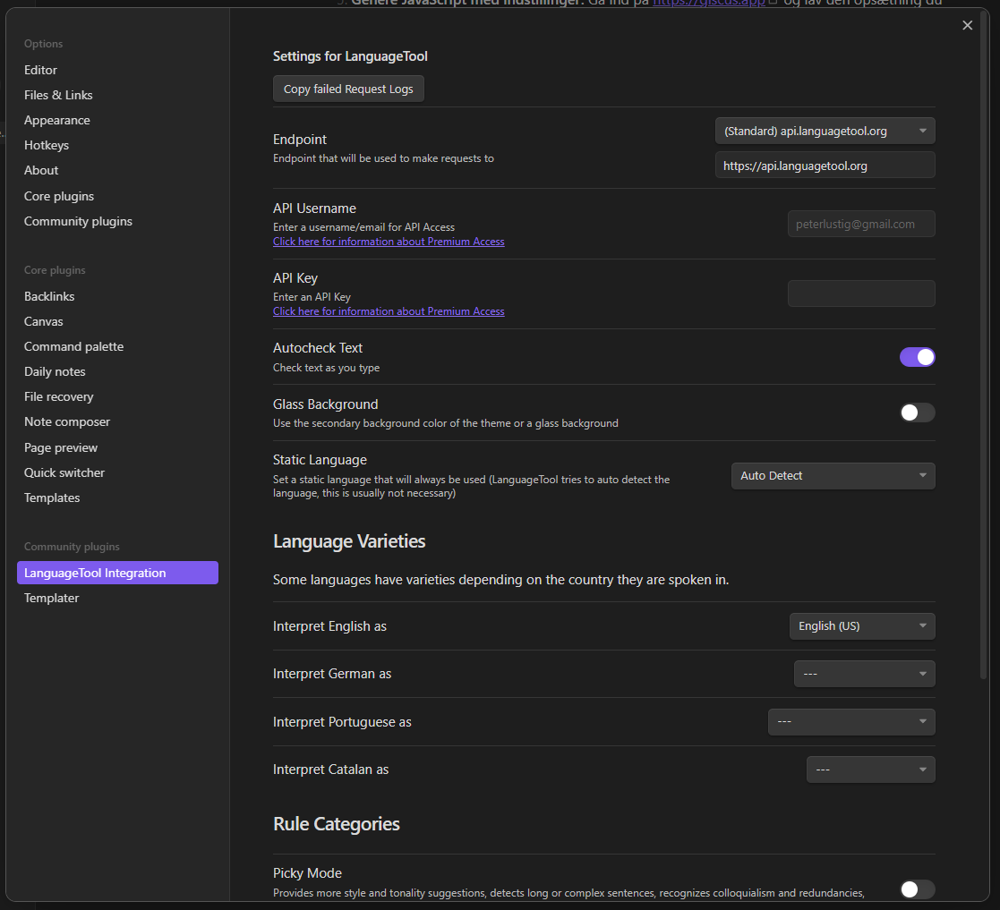
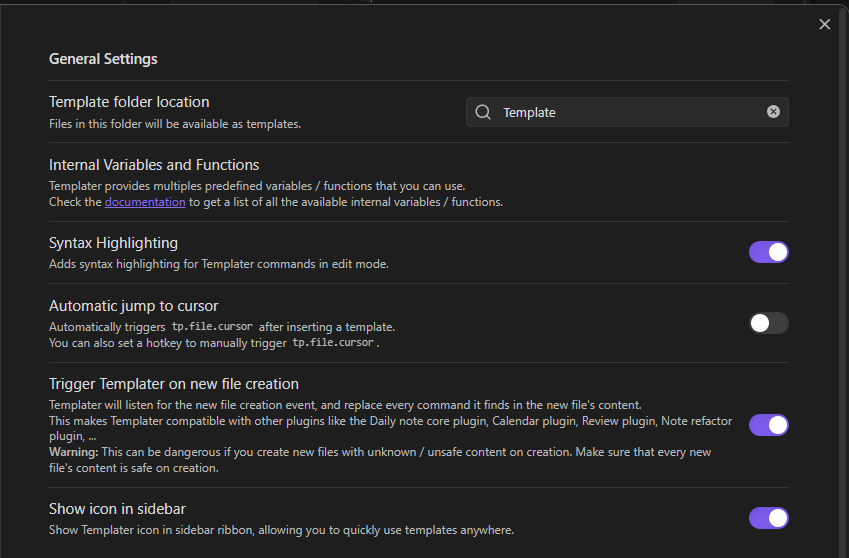

## Indholdsfortegnelse
- [Indholdsfortegnelse](#indholdsfortegnelse)
- [Resumé](#resumé)
- [Intro](#intro)
- [Beskrivelse af diverse teknologier og termer](#beskrivelse-af-diverse-teknologier-og-termer)
	- [GitHub Pages](#github-pages)
	- [GitHub Repository](#github-repository)
	- [GitHub Discussions](#github-discussions)
	- [Jekyll](#jekyll)
	- [Minimal Mistakes](#minimal-mistakes)
	- [Obsidian](#obsidian)
	- [Markdown](#markdown)
	- [Liquid](#liquid)
- [Opsætning af ens side](#opsætning-af-ens-side)
	- [1. DNS](#1-dns)
		- [Opsætning af underdomæne](#opsætning-af-underdomæne)
		- [Opsætning af hoveddomæne](#opsætning-af-hoveddomæne)
		- [Læs mere](#læs-mere)
	- [2. Opsætning repo](#2-opsætning-repo)
	- [3. Opsætning af siden](#3-opsætning-af-siden)
			- [`__data/navigation.yml`](#__datanavigationyml)
		- [`_pages/`](#_pages)
		- [`_posts`](#_posts)
		- [`assets/images/`](#assetsimages)
		- [`_config.yml`](#_configyml)
	- [4. Ekstra ting jeg har tilføjet](#4-ekstra-ting-jeg-har-tilføjet)
		- [Opsætning af kommentarfelt](#opsætning-af-kommentarfelt)
	- [5. Opsætning af Obsidian](#5-opsætning-af-obsidian)


## Resumé 
Her kan du læse om opsætning af denne her blog side og hvordan du selv kan sætte en op.

## Intro
Da jeg sad og undersøgte, hvordan kunne jeg sætte en blog op ledte jeg oprindeligt efter en siden, hvor jeg kunne hoste en hjemmeside med mit domain og kunne bruge en form for template da jeg ikke er så stærk i og kode hjemmesidder 

Der faldt jeg over at man kunne gøre brug af [GitHub Pages](https://pages.github.com) og jo mere jeg undersøgte dette fandt jeg ud af at det var lige det jeg ledte efter. Jeg kunne hoste min side helt gratis, [GitHub Pages](https://pages.github.com) understøtter at man kan bruge sit eget domain, det er muligt at slå et kommentar felt til på sine posts og jeg kan bruge eksterne temaer på min side.

## Beskrivelse af diverse teknologier og termer 
Her beskriver jeg kort diverse teknologier/termer så man forhåbentlig ikke behøver at Google en masse for at forstå dette opslag.

### GitHub Pages
Med [GitHub Pages](https://pages.github.com) kan man oprette en hjemmeside fra bunden som bygges ud fra ens kode der skal ligge i et [GitHub Repository](#GitHub-Repository).

### GitHub Repository
I et [GitHub Repository](https://docs.github.com/en/get-started/quickstart/create-a-repo) (også kaldet et repo) kan man gemmes sit projekt/kode. Med GitHubs mange funktionalitet har man ud over at versionere sin koden også mulighed for at styre issues, diskussioner, wikis sider osv.

### GitHub Discussions
Man kan aktiver [GitHub Discussions](https://docs.github.com/en/discussions) i ens repo, det giver muligheden for at lave et forum til ens projekt.

### Jekyll
[Jekyll](https://jekyllrb.com) er motoren bag [GitHub Pages](https://pages.github.com) som som gør brug af [Markdown](#Markdown), [Liquid](Liquid), HTML & CSS til at generer statisk sider.

### Minimal Mistakes
[Minimal Mistakes](https://mademistakes.com/work/jekyll-themes/minimal-mistakes/) er en fleksibel to kolonner [Jekyll](#Jekyll) tema. 

### Obsidian
[Obsidian](https://obsidian.md) er en vidensdatabase som mange bruger til at tage noter i, noterne skrives i [Markdown](#Markdown) format og man kan installere diverse udvidelse til at gøre det lettere at arbejde med [Markdown](#Markdown) filer.

### Markdown
[Markdown](https://en.wikipedia.org/wiki/Markdown) er et let opmærkningsprog til at skabe formateret tekst ved hjælp af almindelig tekst-editor f.eks. s

### Liquid
[Liquid](https://github.com/Shopify/liquid) er et open-source template language udviklet af [Shopify](https://www.shopify.com/)


## Opsætning af ens side 

### 1. DNS
Hvis man ønsker at bruge sit eget domæne til ens side skal man lave lidt opsætning i sit domænes DNS, det en god idé at sætte det op som noget af det første da det kan godt tage noget tid for at synkronisere rundt.

#### Opsætning af underdomæne
For at opsætte et `www` eller brugerdefineret domæne såsom `www.example.com` eller `blog.example.com`.
Skal du opsætte en CNAME fortegnelse som peger til `<user>.github.io`, hvor `<user>` er dit GitHub brugernavn.

#### Opsætning af hoveddomæne
Opsæt følgende adresser som A fortegnelser:
```
185.199.108.153
185.199.109.153
185.199.110.153
185.199.111.153
```
Opsæt følgende Adresser som AAAA fortagnelser:
```
2606:50c0:8000::153
2606:50c0:8001::153
2606:50c0:8002::153
2606:50c0:8003::153
```

En lille ekstra ting jeg gjorde var at opsætte en CNAME fortegnelse, hvor jeg peger `www` til `<user>.github.io`, hvor `<user>` er dit GitHub brugernavn. Så jeg nemlige sikker på om folk så skriver [boennelykke.com](https://boennelykke.com) eller [www.boennelykke.com](https://www.boennelykke.com) så ender de op på min side.

#### Læs mere 
* [Managing a custom domain for your GitHub Pages site](https://docs.github.com/en/pages/configuring-a-custom-domain-for-your-github-pages-site/managing-a-custom-domain-for-your-github-pages-site)

### 2. Opsætning repo
Jeg går ud fra man allerede ved lidt om GitHub og ved, hvordan man opretter et repo og en ny branch. Ellers kan man læse om det her: 
* [Create a repo](https://docs.github.com/en/github-ae@latest/get-started/quickstart/create-a-repo)
* [Creating and deleting branches within your repository](https://docs.github.com/en/pull-requests/collaborating-with-pull-requests/proposing-changes-to-your-work-with-pull-requests/creating-and-deleting-branches-within-your-repository)

Hvis man ønsker at ens side skal ligne min kan man bruge denne [Template](https://github.com/mmistakes/mm-github-pages-starter/generate) og følge beskrivelsen herunder:
1. Opret nyt repo og kald det `<user>.github.io`, hvor `<user>` er dit GitHub brugernavn og sørg for at lave det public.
	1. `<user>.github.io` er et reseveret navn til [GitHub Pages](https://pages.github.com) og det er meget vigtigt at du skriver dit brugernavn rigtigt ellers vil det ikke virke.
2. I dit repo > Settings > Pages under Code and automation her styre man diverse indstillinger f.eks. hvilken branch der skal bruges til at bygge din side.
	1. Hvis man vil bruge et sit eget domain skal man sætte dette under Custom domain, vent herefter på DNS tjekket går godt så du kan sætte flueben i Enforce HTTPS. Hvis tjekket ikke går godt så vend tilbage om en time og prøv igen, hvis du lige har lavet din DNS opsætning.
3. Opret en ny brach
	1. Denne nye branch skal du bruge til lave dine ændringer i og lave pull request fra til din main branch. Fordi hvis man arbejder i ens main brach så ,hver gang med pusher til main skal man vente lidt og pull de nye commits ned som GitHub Pages automatisk opretter.

Hvis det ikke helt giver mening det jeg har skrevet eller man gerne vil prøve det lidt af først kan man lave følgende [skill kursus](https://github.com/skills/github-pages) fra GitHub.

### 3. Opsætning af siden
Indstillinger for hele din side styres i `_config.yml` og man læse om alle mulighederne [her](https://mmistakes.github.io/minimal-mistakes/docs/configuration/)

##### `__data/navigation.yml`
Styre menu oppe til højre på din side
<figure>
    <a href="/assets/images/2023-05-30/Menu.png"></a>
</figure>

{: .align-center}


Filen skulle gerne indeholde følgende:

```yml
main:
  - title: "Posts"
    url: /posts/
  - title: "Categories"
    url: /categories/
  - title: "Tags"
    url: /tags/
  - title: "About me"
    url: /about/
```

Titel er visningsnavnet og url'en er permalink der hendviser til en side du kan se under mappen `_pages`.

For at læse mere om navigation tryk [her](https://mmistakes.github.io/minimal-mistakes/docs/navigation/).

#### `_pages/`
I denne mappe finder man siderne der er nævnt under [`__data/navigation.yml`](#__datanavigationyml), det kan være en god idé at opdatere `about.md`.

Man kan læse mere om pages [her](https://mmistakes.github.io/minimal-mistakes/docs/pages/).

#### `_posts`
I denne mappe skal man ligge alle sine posts til ens side, man kan læse mere om det [her](https://mmistakes.github.io/minimal-mistakes/docs/posts/). 

Helt simpelt, hvis man vil lave et nyt post opretter man en fil med følgende navneformat `YEAR-MONTH-DAY-title.md` og i toppen af filen indsætter man følgende:

```markdown
---
title: ""
categories:
  - Blog
tags:
  - XXXX
---
```

F.eks. dette post du læser nu kan du se [her](https://github.com/Mark5900/Mark5900.github.io/blob/main/_posts/2023-05-20-Hvordan-denne-her-hjemmeside-er-sat-op.md).

#### `assets/images/`
Mappen indeholder et demo billede til ens blog, enden upload et nyt billede med samme navn og format ellers skal du blot lige rette det i [`_config.yml`](#_configyml).

#### `_config.yml`
Indeholder de overordnet indstillinger for hele din side, den skal man lige løbe igennem og rette lidt til. Hvis man ønsker at tilføje mere funktionalitet eller se, hvad de forskellige indstillinger gør kan man læse mere [her](https://mmistakes.github.io/minimal-mistakes/docs/configuration/).

### 4. Ekstra ting jeg har tilføjet

#### Opsætning af kommentarfelt
Det er relativt simpelt at opsætte kommentarfelt på ens posts man skal blot:
1. **Vælge en kommentarudbyder**: Man kan vælge mellem [**Disqus**](https://disqus.com/), [**Discourse**](https://www.discourse.org/), [**Facebook**](https://developers.facebook.com/docs/plugins/comments), [**utterances**](https://utteranc.es/), [**giscus**](https://giscus.app/), [**Staticman**](https://staticman.net/) eller andet. Jeg valgte at bruge [**giscus**](https://giscus.app/) da denne gør brug af [GitHub Discussions](https://docs.github.com/en/discussions).
2. **Aktiver GitHub Discussions:** I dit repo tryk på settings >scroll ned og sæt flueben i Discussions
3. **Opsæt ny kategori i  Discussions (valgfrit):** I dit repo tryk på Discussions > tryk på blyanten ved siden af Categories > New category > lav den opsætning du øsnker. Jeg har sat min op på denne her måde: ![[Discussions_Category.png]]
4. **Installer giscus appen:** Installer appen via dette [link](https://github.com/apps/giscus) og sørg for at kun at give app'en adgang til dette ene repo.
5. **Genere JavaScript med indstillinger:** Gå ind på [https://giscus.app](https://giscus.app) og lav den opsætning du ønsker. Det vil blive oprettet et JavaScript der indeholder de indstillinger som skal bruges til at lave resten af din opsætning.
6. **Tilføj følgende i `_config.yml`:**

```yml
# Set which comment system to use
repository: # GitHub username/repo-name e.g. "mmistakes/minimal-mistakes"

comments:
  provider: "giscus"
  giscus:
    repo_id              : # Shown during giscus setup at https://giscus.app
    category_name        : # Full text name of the category
    category_id          : # Shown during giscus setup at https://giscus.app
    discussion_term      : # "pathname" (default), "url", "title", "og:title"
    reactions_enabled    : # '1' for enabled (default), '0' for disabled
    theme                : # "light" (default), "dark", "dark_dimmed", "transparent_dark", "preferred_color_scheme"
```

Læs mere [her](https://mmistakes.github.io/minimal-mistakes/docs/configuration/#comments)

### 5. Opsætning af Obsidian
For at gøre min skriveoplevelse lettere har jeg valgt at opsætte en Obsidian vault i mit projekt. 
1. Dowload Obsidian ([her](https://obsidian.md))
2. I Obsidian vælge at "Open folder as vault" jeg har valgt at åbne roden af mit projekt men man kan sagtens også blot gøre det i mappen `_posts`
3. **Installer stavekontrol** - Det er ikke den bedste stavekontrol men det er bedre end ingenting.  
	1. I Obsidian tryk på Settings > Community plugins > Browse
	2. Installer "LanguageTool Integration"
	3. Sørg for at plugin'et er aktiveret under Community plugins
	4. Under plugin'ets options har jeg sat følgende op
4. **Installer Templater -** der findes allerede understøttelse til at bruge templates i Obsidian, dog mangler den funktionaliteten til at sætte overskriften af ens note/post så derfor valgte jeg at bruge Templater.
	1. Opret en mappe med et sigende navn, min mappe hedder "Template"
	2. Opret en fil med et sigende navn, min fil hedder "1. Standard" og indeholder følgende:
   
	```markdown
	---
	title: ""
	categories:
	  - Blog
	tags:
	  - Post Formats
	---
	
	<% tp.file.rename(tp.date.now() + "-Titel") %>
	```

	3.  I Obsidian tryk på Settings > Community plugins > Browse
	4. Installer "Templater"
	5. Sørg for at plugin'et er aktiveret under Community plugins
	6. Under plugin'ets options har jeg sat følgende op
	7. Nu kan man enten tryk `Alt` + `N` for at oprette en ny note med templaten "1. Standard" eller jeg kan oprette en ny fil og derefter indsætte min template via Templeter.